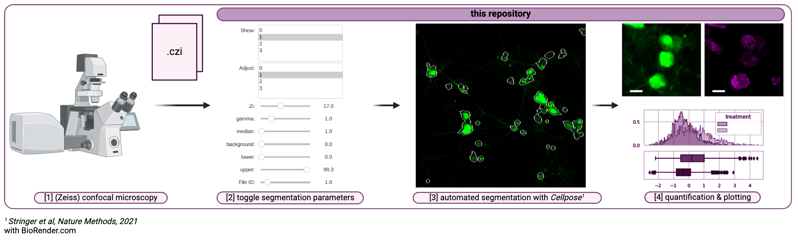

# End-to-end Confocal Image Processing 
### using pre-trained Cellpose models[^1]



- This repository provides a number of functions for image processing (loading, processing, and segmentation using inference by pre-trained Cellpose[^1] models), viewing (a number of notebook widgets are implemented to facilitate pre-processing and segmentation assessment), and plotting (normalized - intensities per segmented region by experimental category of interest, quantification, and representative images). 
- `do_inference` function could easily be replaced with other pre-trained models (e.g. [^2], or from other sources)
- This repository was used to process confocal images related to a project [here](https://github.com/djunamay/ABCA7lof2?tab=readme-ov-file); See use-case example below

## Prerequisites

1. Basic requirements:
- Python 3
- Access to a GPU

2. Cellpose installation:
- [Cellpose](https://github.com/MouseLand/cellpose)

3. Download Cellpose models:
For more info see [Cellpose docs](https://cellpose.readthedocs.io/en/latest/models.html)
```python
from cellpose import models
model = models.Cellpose(model_type='cyto2')
```

4. Other (available by `pip install`):
- [argparse]
- [ast]
- [numpy]
- [torch]
- [tqdm] 
- [aicsimageio] 

5. Install repo:
```bash
git clone git@github.com:djunamay/confocalQuant.git
```

6. Run tests:
- Download the test data on [Figshare](https://figshare.com/s/dc1ee3477747549da376)
```bash
pip install assertpy
pip install pytest
python -m pytest tests.py
```

## Quickstart

1. The `example_[...].ipynb` notebooks will help you run a couple of quick experiments on your data to find segmentation parameters that work for you with your selected Cellpose model (data for the example notebooks are available through [Figshare](). 

2. Once you have identified parameters that work for your segmentation purposes, you can update the following line of code and run that in your terminal or update the `run_jobs.sh` file to submit to a job scheduler and process multiple images in parallel. 

```bash
python main_script.py --folder path/to/results --impath path/to/image --channels 0 1 2 --y_channel 0 --kernel 3 --bgrnd_subtraction_vals 10 20 30 --diameter 50 --inf_channels 0 1 --min_size 100 --Ncells 500 --cells_per_job 50 --NZi 10 --zi_per_job 2 --xi_per_job 512 --yi_per_job 512 --Njobs 10 --gamma_dict {0: 1.0, 1: 1.2} --lower_thresh_dict {0: 10, 1: 20} --upper_thresh_dict {0: 90, 1: 95} --outdir path/to/output --preprocess --normalize
```

3. As results are processing, check the `--outdir` folder to monitor segmentation results (projections) as they come in 

4. Finally, go back to the `example_[...].ipynb` notebooks to view the results, perform some simple sanity checks, and plot signal intensity quantifications for segmented regions.

## Methods

For methods on how we applied the Cellpose models, see our [paper](https://github.com/djunamay/ABCA7lof2). 

## Repository overview

- `example_segmentation.ipynb` notebook guiding user through the pipeline
- `main.py` performs image processing and segmentation with user-defined parameters
- `run_jobs.sh` example file for submission with job scheduler 
- `./models/` save ***cellpose** models here
- `./data/` save raw data here (in ***czi*** file format; example `./data/experiment_1`)
- `./outs/` outputs of `main_script.py` run will be saved here (including `masks.npy`, `mat.npy`, `Nzi_per_job.npy`, `probs.npy`, `randomID_per_job.npy`; example `./outs/experiment_1_out`)
- `./confocalQuant/` functions called in `main_script.py` for processing and segmentation and in `example_segmentation.ipynb` for viewing and plotting

## Example Use-Case

- This code was used to process images associated with our [Github Repository](https://github.com/djunamay/ABCA7lof2?tab=readme-ov-file)
- Raw image data for this example is available on [figshare]() (coming soon). Download the imaging data and place it in the `./data/` directory
- Create sub-folders in the `./outs/` directory, based on the raw data folders downloaded (e.g. `./outs/neuronbatch11082023_mitohealth_out`)
- For each experiment place the corresponding `out.sbatch` file into its corresponding `./outs/` sub-directory (e.g. `out_neuronbatch11082023_mitohealth.sbatch` into `./outs/neuronbatch11082023_mitohealth_out`, available from [figshare](https://figshare.com/s/71fcf19eb8b67c3c0bff)
- Modify the `.sbatch` to work with your scheduler, paths, folder names as indicated (`# Update`) in the file
- Create a  `segmentations` folder within each `./outs/` sub-directory
- To run an experiment, navigate into the corresponding `./data/` sub-directory and run 
```bash
sbatch out_[...].sbatch
```
- Download the data analysis & plotting notebooks from [figshare](https://figshare.com/s/43fddaa74fafdaa85e20) and place them in the `./notebooks/` directory
- The `individual_quantifications_[..].ipynb` notebooks take as input the outputs from the `out_[...].sbatch` run and allow you to (1) perform sanity checks on the imaging batch, (2) toggle through images (blinded / randomly) to evaluate segmentations, and (3) Compute per-cell mean fluorescent intensities for channels of interest 
- The `combined_quantifications_[..].ipynb` notebooks take as input the processed data outputs from `individual_quantifications_[..].ipynb` (or download these inputs from [figshare](https://figshare.com/s/0ea2ed2fa837962c7702)) and allow combined analyses and plotting across multiple batches
- The `rep_images_[..].ipynb` notebooks allow you to identify and visualize representative images

## References
[^1]: @article{Stringer2020,
  title = {Cellpose: a generalist algorithm for cellular segmentation},
  volume = {18},
  ISSN = {1548-7105},
  url = {http://dx.doi.org/10.1038/s41592-020-01018-x},
  DOI = {10.1038/s41592-020-01018-x},
  number = {1},
  journal = {Nature Methods},
  publisher = {Springer Science and Business Media LLC},
  author = {Stringer,  Carsen and Wang,  Tim and Michaelos,  Michalis and Pachitariu,  Marius},
  year = {2020},
  month = dec,
  pages = {100–106}
}

[^2]: @article{Pachitariu2022,
  title = {Cellpose 2.0: how to train your own model},
  volume = {19},
  ISSN = {1548-7105},
  url = {http://dx.doi.org/10.1038/s41592-022-01663-4},
  DOI = {10.1038/s41592-022-01663-4},
  number = {12},
  journal = {Nature Methods},
  publisher = {Springer Science and Business Media LLC},
  author = {Pachitariu,  Marius and Stringer,  Carsen},
  year = {2022},
  month = nov,
  pages = {1634–1641}
}